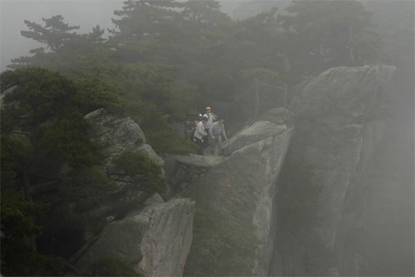
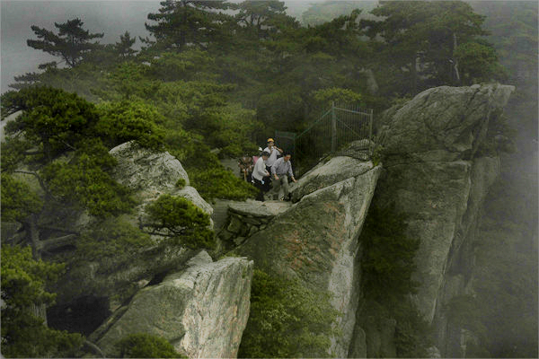
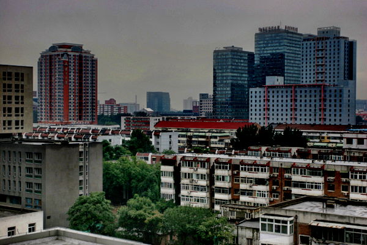

## Joint Contrast Enhancement and Exposure Fusion for Real-World Image Dehazing
**Xiaoning Liu**, **Hui Li***, Ce Zhu

This paper is accepted by [IEEE TMM](https://ieeexplore.ieee.org/document/9537303).

## Testing Set
* [Daytime fog images](https://www.cs.huji.ac.il/w~raananf/projects/dehaze_cl/results/)
* [Nighttime fog images](https://github.com/chaimi2013/MRP)
* [Foggy Driving](http://people.ee.ethz.ch/~csakarid/SFSU_synthetic/)

## Evaluation Metric
[Fog Aware Density Evaluator (FADE)](http://live.ece.utexas.edu/research/fog/index.html)

## Testing

```python
matlab demo.m
```

## Real Image Dehazing
* Real daytime dehazing
-  
-  


References
----------
```BibTex
@arctile{liu2021joint, % CEEF
  title={Joint Contrast Enhancement and Exposure Fusion for Real-World Image Dehazing},
  author={Liu, Xiaoning and Li, Hui and Zhu, Ce},  
  journal={IEEE Transactions on Multimedia},   
  year={2021},  
  volume={},  
  number={},  
  pages={1-1},  
  year-{2021}
  doi={10.1109/TMM.2021.3110483}
}
```
